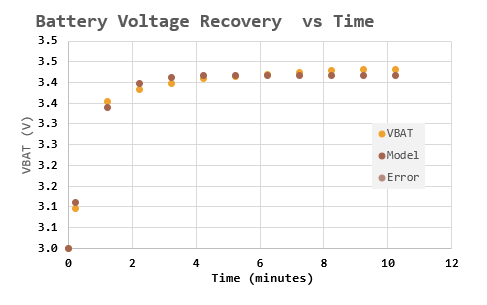

# Effect of Charging Algorithm on Retained Internal Charger Battery Capacity

## Introduction

I am beginning to perform testing on various battery charging algorithm to determine their effect on the loss of battery capacity with charge cycles. Because every battery has a different initial capacity, this work focuses on determining the change in normalized capacity versus cycle number under the following "treatments":

* Vendor recommend profile The vendor recommends a standard constant current/constant voltage sequence.
* Fast charging Customers like having the option of a fast charge to get some quick capacity when they don't have time for a full-charge. The question for us is does this charging mode have an impact on battery capacity over cycles.
* Extended fast charging This testing will determine the sensitivity on battery capacity to the time of fast charging.

Another factor that is important is the amount of time the battery sits "floating" at a nearly-full charge (high voltage). A test will be added to determine the impact of floating for 2 days after each cycle.

## Background

### Definitions

<dl>
<dt>Aging</dt>
<dd>When I hear the term battery aging, I assume loss of battery capacity with respect to charge cycles. Understand that batteries lose capacity while just sitting there — through corrosion. Unless you are in a backup power situation – I spent years working on telcom backup batteries for cell towers – your biggest aging issue is with cycling.</dd>
<dt>Cycle</dt>
<dd>A full-voltage range charge and discharge of the battery. The impact of cycling on capacity is a strong function of how deeply the battery is discharged and how fully charged the battery is cycled. For consistency of results, we only test over the full range.</dd>
<dt>Normalized Capacity</dt>
<dd>The capacity at a given cycle number divided by the initial capacity (first discharge cycle).</dd>
<dt>Recovery</dt>
<dd>After being under some electrical stress (charging or discharging), the unstressed battery open-cell voltage will return to an equilibrium value. This has to do with the ions in the battery rearranging after the external stimulus is removed. This is normal and must be accounted for when setting thresholds.</dd>
<dt>Open Cell Voltage</dt>
<dd>The battery voltage with no external stimulus.</dd>
<dt>Constant Current Charging</dt>
<dd>The battery is charged with a constant current that terminates when the cell voltage reaches a defined limit (<i>VCV</i>).</dd>
<dt>Constant Voltage Charging</dt>
<dd>The battery is charged with a constant voltage that is removed when the battery current drops below a specified level (<i>ICV</i>).</dd>
</dl>

### Charging Scenarios

#### Standard Scenario

## Analysis

### Comparison of Normalized Battery Capacity versus Cycle Number

### Battery Recovery Characteristic

I took a look at how quickly the battery recovers from being discharged. The recovery characteristic is not an exponential, but I decided to model it as such. The time constant is 1.3 minutes with a recovery amplitude of 0.42 V.

## Conclusion
